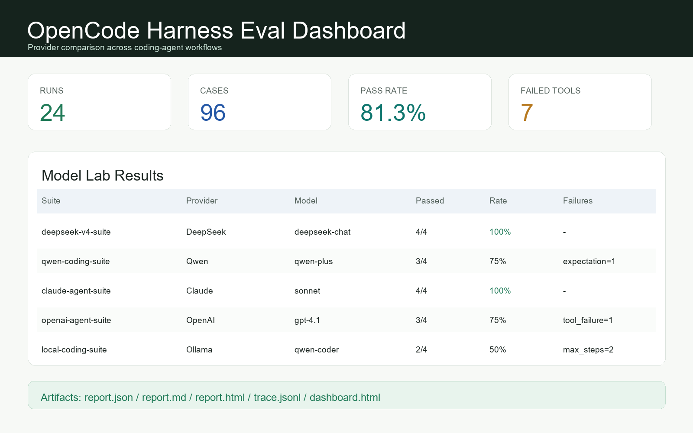

# OpenCode Harness

[](https://github.com/samarailly51-pixel/opencode-harness/actions/workflows/ci.yml)
[](https://github.com/samarailly51-pixel/opencode-harness/actions/workflows/pages.yml)
[](https://github.com/samarailly51-pixel/opencode-harness/releases/tag/v0.1.0)
[](LICENSE)
[](pyproject.toml)

OpenCode Harness is a clean-room, model-agnostic AI coding agent harness that standardizes how Claude Code / Codex-class coding agents execute tasks, call tools, produce traces, and generate evaluation reports.

中文定位：OpenCode Harness 是一个面向 AI coding agent 的开源运行与评测框架，用统一的 agent loop、工具权限、trace、eval suite 和报告系统，把一次性的 coding demo 变成可复现、可追踪、可对比、可诊断的工程流程。

This project does not contain or derive from Claude Code source code. It is an independent clean-room implementation of a coding-agent harness.

## Links

- Website: <https://samarailly51-pixel.github.io/opencode-harness/>
- DeepSeek case study: <https://samarailly51-pixel.github.io/opencode-harness/deepseek-case-study.html>
- Release: <https://github.com/samarailly51-pixel/opencode-harness/releases/tag/v0.1.0>
- 中文介绍: [docs/zh-intro.md](docs/zh-intro.md)
- Product positioning: [docs/product-positioning.md](docs/product-positioning.md)
- Presentation guide: [docs/presentation-guide.md](docs/presentation-guide.md)
- DeepSeek diagnosis: [docs/deepseek-failure-mode-diagnosis.md](docs/deepseek-failure-mode-diagnosis.md)
- Demo workflow: [examples/demo-workflow.md](examples/demo-workflow.md)



## Target Users

- AI 产品经理：需要解释 coding agent 的产品边界、用户价值、评测指标和失败模式。
- AI Agent 应用开发者：需要把模型、工具、权限、trace 和评测流程组合成可运行系统。
- 模型评测 / Agent 评测团队：需要用统一任务和报告比较不同 provider 或不同 agent loop。
- 本地模型和开源模型使用者：需要在 DeepSeek、Qwen、OpenAI-compatible、本地推理服务之间复用同一套 workflow。
- 项目展示场景：需要用真实项目说明 agent 产品化、评测闭环和工程落地。

## User Pain Points

很多 AI coding assistant 看起来能写代码，但在真实产品化时会遇到几个问题：

- 执行流程不透明：不知道模型读了什么、调用了什么工具、为什么失败。
- 难以复现：同一个任务换一次模型或 prompt，结果很难横向比较。
- 缺少权限边界：文件写入、shell 命令、网络访问和外部工具调用需要可控策略。
- 缺少评测闭环：只有聊天结果，没有结构化 report、trace、dashboard 和 failure taxonomy。
- 难以产品化讲清楚：无法把 agent 能力拆成输入、计划、执行、验证、报告这些用户可理解环节。

## Core Features

- Model-agnostic provider layer for DeepSeek, Qwen, Claude, OpenAI, local OpenAI-compatible endpoints, vLLM, SGLang, Ollama, and mock mode.
- Permissioned tool system for file read/write, search, patch, shell, git diff, repo map, context pack, todo, and finish events.
- MCP-compatible extension points for stdio tools, resources, prompts, per-server approvals, lifecycle diagnostics, and namespace collision handling.
- Reproducible eval suites with `report.json`, `report.md`, `report.html`, comparison reports, and dashboards.
- JSONL traces and provider transcripts for auditability, replay, debugging, and failure-mode diagnosis.
- Trace-aware failure-mode diagnosis from eval reports and JSONL traces, including failure grouping, repeated-tool detection, marker checks, and suggested next actions.
- Before/after diagnosis comparison for measuring reliability changes across agent-loop, prompt, tool-policy, or provider updates.
- Repair evals can feed verifier output back into the agent loop with configurable `verify_feedback_attempts`.
- Model Labs for DeepSeek, Qwen, Claude, OpenAI, and local model workflows.

## Architecture Flow

```text
Task Input
  -> Planning
  -> Tool Execution
  -> Review
  -> Report
```

| Stage | What Happens | Product Value |
| --- | --- | --- |
| Task Input | User or eval suite provides a coding task and workspace. | Makes tasks reproducible instead of ad hoc chat prompts. |
| Planning | Agent creates or updates a plan with todo tools and repository context. | Shows how the agent decomposes work before executing. |
| Tool Execution | Agent calls read/search/patch/shell/MCP tools under permission policy. | Keeps risky operations auditable and controllable. |
| Review | Agent observes tool outputs, verifies results, and decides whether to continue. | Captures whether the loop can close, not only whether it can generate text. |
| Report | Harness writes traces, transcripts, eval reports, comparison tables, dashboards, diagnosis notes, and before/after comparisons. | Turns agent behavior into evidence for debugging and product decisions. |

## Quick Start

Run the offline mock eval with no API key:

```powershell
$env:PYTHONPATH='src'
python -m opencode_harness eval examples/mock-suite.json --preset mock --max-steps 2 --context-chars 1000
```

Inspect the latest trace:

```powershell
$trace = Get-ChildItem eval-runs -Recurse -Filter inspect-repo.jsonl | Sort-Object LastWriteTime -Descending | Select-Object -First 1
python -m opencode_harness tui $trace.FullName --width 88
python -m opencode_harness trace-html $trace.FullName --output eval-runs/latest-trace.html
python -m opencode_harness dashboard eval-runs --output eval-runs/dashboard.html
```

Generate a trace-aware failure diagnosis from one or more eval reports:

```powershell
python -m opencode_harness diagnose eval-runs/path-to-run/report.json --output eval-runs/diagnosis.md
```

Compare before/after reliability changes:

```powershell
python -m opencode_harness diagnose-compare `
  --before eval-runs/before/report.json `
  --after eval-runs/after/report.json `
  --before-label "Before guard" `
  --after-label "After guard" `
  --output eval-runs/before-after.md
```

Run DeepSeek-only benchmark after setting your local API key:

```powershell
$env:DEEPSEEK_API_KEY = "..."
.\scripts\run-deepseek-benchmark.ps1 -SuiteSet all
```

Run the focused DeepSeek reliability iteration after an agent-loop change:

```powershell
$env:DEEPSEEK_API_KEY = "..."
.\scripts\run-deepseek-reliability-iteration.ps1 -SuiteSet repair
```

Run one task with a provider preset:

```powershell
$env:DEEPSEEK_API_KEY = "..."
python -m opencode_harness run "inspect this repository and suggest one improvement" --preset deepseek
```

## Demo Example

Example task:

```text
Inspect this repository and propose one small documentation improvement.
Do not edit files; finish with the proposed patch idea.
```

Expected harness flow:

1. Task Input: eval suite loads the task and workspace.
2. Planning: agent builds a short plan.
3. Tool Execution: agent reads README and searches repository context.
4. Review: agent checks whether enough evidence was collected.
5. Report: harness writes trace files and a Markdown/HTML eval report.

See the full walkthrough: [examples/demo-workflow.md](examples/demo-workflow.md).

## Published Evidence

| Surface | Link |
| --- | --- |
| Public website | <https://samarailly51-pixel.github.io/opencode-harness/> |
| GitHub release | <https://github.com/samarailly51-pixel/opencode-harness/releases/tag/v0.1.0> |
| Mock smoke benchmark | [benchmarks/v0.1-mock-smoke](benchmarks/v0.1-mock-smoke/README.md) |
| Real provider benchmark | [benchmarks/real-provider-comparison](benchmarks/real-provider-comparison/README.md) |
| DeepSeek failure-mode case study | [docs/deepseek-failure-mode-diagnosis.md](docs/deepseek-failure-mode-diagnosis.md) |
| Website case page | <https://samarailly51-pixel.github.io/opencode-harness/deepseek-case-study.html> |
| Product Hunt package | [docs/product-hunt-final-package.md](docs/product-hunt-final-package.md) |

## Highlights for AI PM / Agent Application Presentations

- Product framing: turns coding-agent behavior from an opaque chat interaction into a measurable workflow.
- User-centered design: separates target users, user pain points, workflow stages, reports, and failure diagnosis.
- Agent architecture: demonstrates provider abstraction, tool orchestration, permission policy, traces, and eval suites.
- Evaluation mindset: includes real DeepSeek benchmark results and a failure-mode diagnosis rather than only success demos.
- Launch readiness: includes CI, release artifacts, GitHub Pages, demo video assets, Product Hunt package, and bilingual documentation.

## DeepSeek Lab Snapshot

The first DeepSeek-only diagnostic benchmark set uses `deepseek-chat` through an OpenAI-compatible adapter:

| Suite | Result | Main Failure Modes |
| --- | ---: | --- |
| Smoke | 1/4 passed | marker drift, expectation mismatch |
| Long context | 1/4 passed | expectation mismatch, max steps |
| Repair | 0/2 passed | repair finalization gap |

These results are intentionally not presented as a leaderboard. They show that the harness can expose concrete coding-agent failure modes such as marker-following drift, tool-loop overrun, long-context synthesis gaps, and repair finalization gaps.

The repair loop has since been tightened so `verify_command` failures can be surfaced back into the same agent session for another repair attempt. The published DeepSeek snapshot above is kept as the first diagnostic baseline until the next real-provider rerun.

## Model Labs

- [DeepSeek Lab](model-labs/deepseek/README.md): DeepSeek V4-class behavior, provider comparison, tool-calling stability, long-context tasks, repair tasks, and failure-mode diagnosis.
- [Qwen Lab](model-labs/qwen/README.md): Qwen provider behavior, Chinese coding tasks, JSON fallback discipline, and provider comparison.
- [Claude Lab](model-labs/claude/README.md): Anthropic native tool use, Claude provider behavior, repair readiness, context synthesis, and provider comparison.
- [OpenAI Lab](model-labs/openai/README.md): OpenAI-compatible baseline behavior, native tool calls, transcript auditability, context synthesis, and provider comparison.
- [Local Model Lab](model-labs/local/README.md): vLLM, SGLang, Ollama, and local OpenAI-compatible endpoint behavior, transcript auditability, and provider comparison.

## Repository Map

```text
src/opencode_harness/      Core runtime, models, tools, evals, traces
model-labs/                DeepSeek, Qwen, Claude, OpenAI, local model labs
benchmarks/                Public benchmark summaries
docs/                      Product positioning, launch, diagnosis, presentation docs
examples/                  Demo suites and workflow examples
site/                      Static website and DeepSeek case page
scripts/                   Demo and benchmark runner scripts
tests/                     Unit tests
```

## Project Docs

- [Product positioning](docs/product-positioning.md)
- [Presentation guide](docs/presentation-guide.md)
- [中文介绍](docs/zh-intro.md)
- [DeepSeek failure-mode diagnosis](docs/deepseek-failure-mode-diagnosis.md)
- [Provider benchmark guide](docs/provider-benchmarks.md)
- [Launch readiness](docs/launch-readiness.md)
- [Architecture](docs/architecture.md)
- [Roadmap](ROADMAP.md)
- [Contributing](CONTRIBUTING.md)
- [Security](SECURITY.md)
- [License](LICENSE)
